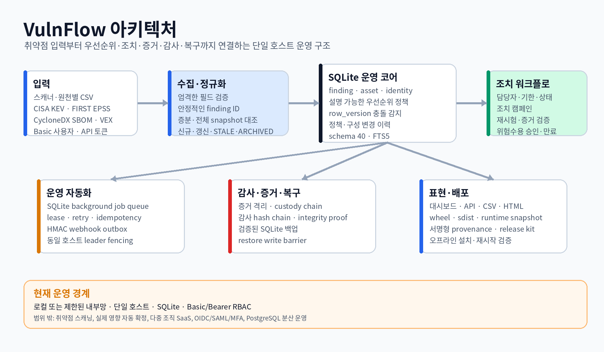
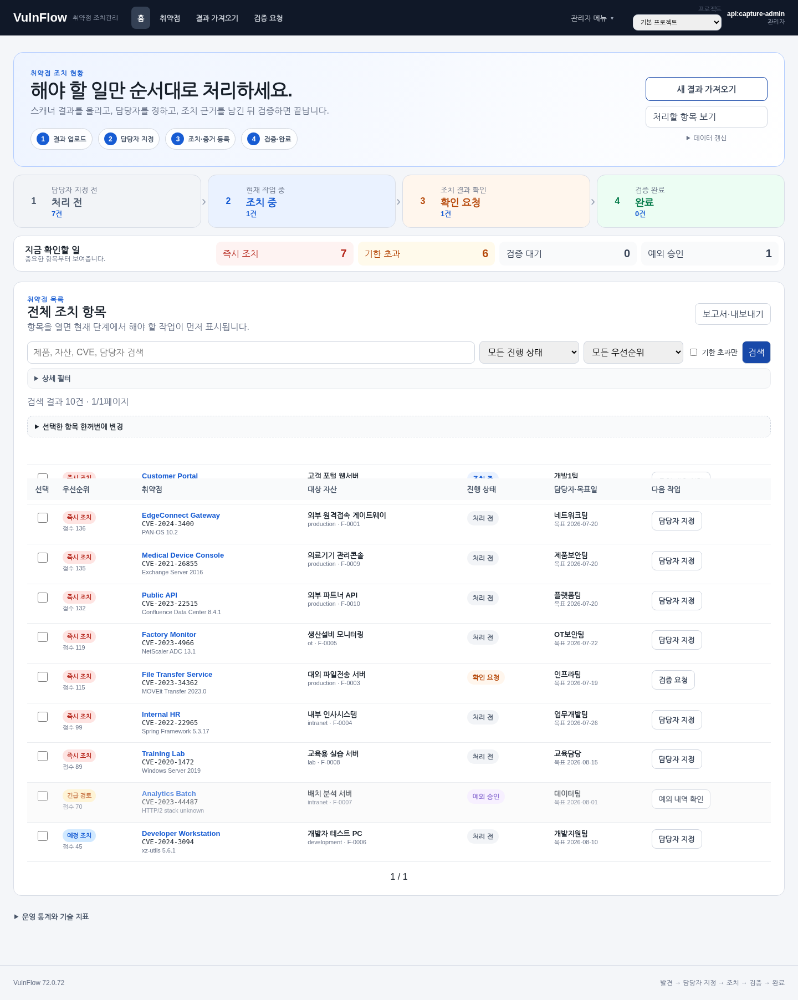
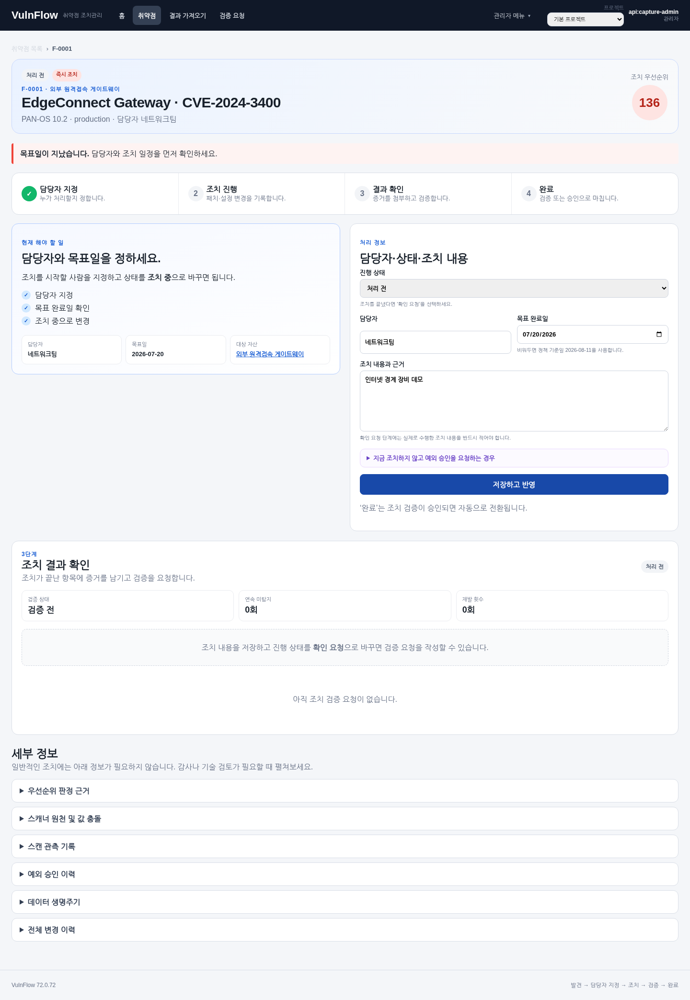
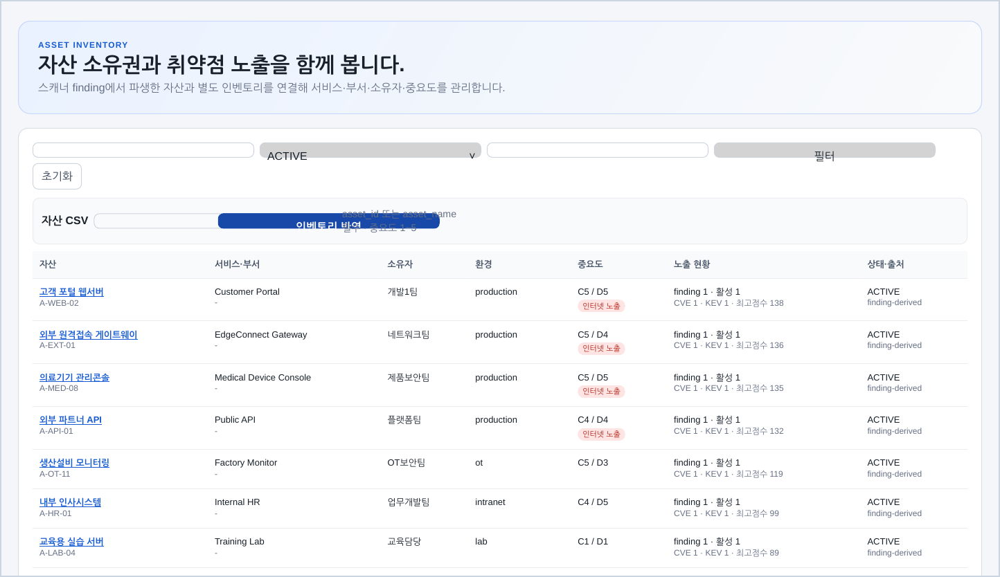
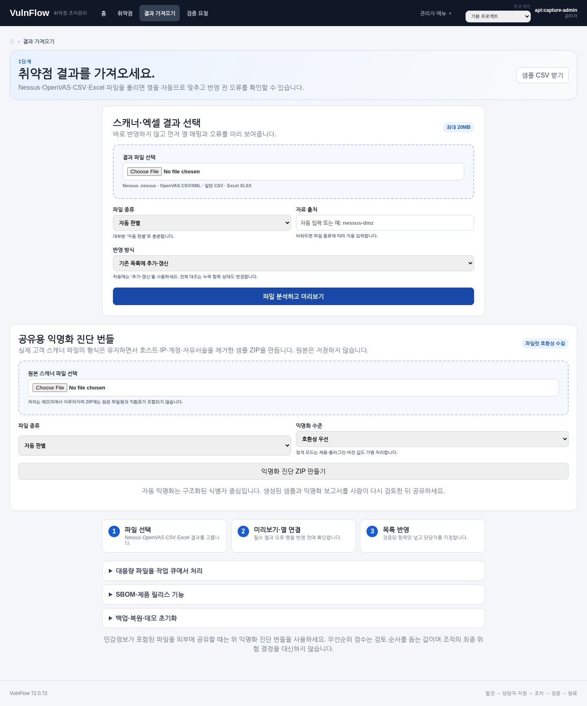
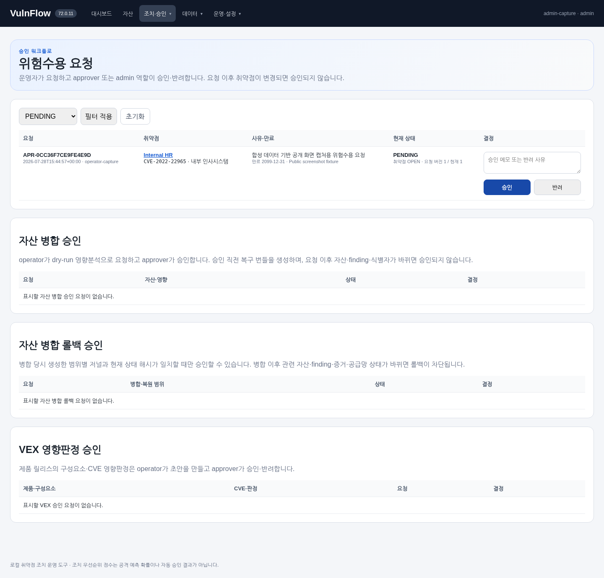

# VulnFlow Free — Public Beta (Core 72.0.102)

[](https://github.com/bbk0416/vulnflow/actions/workflows/public-ci.yml)


> **스캐너는 이미 있는 팀을 위한 local-first 취약점 조치 closeout 도구** — 결과를 가져온 뒤 담당자 지정, 조치, 재검증, 승인, 증거와 보고까지 닫습니다.
>
> **A local-first vulnerability-remediation closeout workspace** for teams that already have scanners and need a controlled path from scan findings to verified closure.

### Start here

**[5-minute Quick Start →](docs/QUICKSTART_5_MIN.md)**

Python 3.12–3.13 · Windows/Linux/macOS · local/self-hosted

Tried VulnFlow? **[Share Free Public Beta feedback →](https://github.com/bbk0416/vulnflow/issues/new?template=beta_feedback.yml)**<br>
Please do not include real vulnerability data, internal asset identifiers, credentials, or personal information.



## 프로젝트 목적

취약점 스캐너는 결과를 만들어 주지만, 조직은 그 이후에도 중복 정리, 자산 식별, 우선순위 결정, 담당자 지정, 조치 확인, 예외 승인과 감사 대응을 수행해야 합니다. VulnFlow는 이 운영 흐름을 하나의 로컬 애플리케이션으로 구조화합니다.

**이 프로젝트는 취약점 스캐너가 아닙니다.** 실제 영향 자동판정이나 상용 엔터프라이즈 제품을 주장하지 않습니다. 포함된 모든 샘플 데이터는 합성 데이터입니다.

### 현재 상태 — Free Public Beta

VulnFlow는 현재 **무료 공개 베타(Free Public Beta)** 로 제공합니다. 코어 버전은 `72.0.102`이며, 신규 기능을 선제적으로 늘리기보다 실제 스캐너 호환성, 사용 흐름의 막힘, 보안·신뢰성 결함에서 확인된 문제만 수정합니다.

- 현재 결제, 유료 구독, 상용 SLA 또는 유료 지원 상품은 제공하지 않습니다.
- 현재 공개된 `72.0.102` 소스는 MIT License이며 해당 버전에 부여된 권리는 그대로 유지됩니다.
- 기본 제품은 사용자가 직접 운영하는 로컬/self-hosted 방식입니다. 이메일·Jira·OSV 등 외부 연동을 직접 설정하면 해당 기능에 필요한 외부 통신이 발생할 수 있습니다.
- 향후 사업 운영 기반이 마련되면 **구독형 유료 에디션(working name: VulnFlow Pro)** 을 별도로 도입할 수 있습니다. 기능·가격·라이선스는 아직 확정하지 않았으며, 현재 MIT 릴리스의 권리를 소급해 제한하지 않습니다.

무료 베타의 목적은 다운로드 숫자를 꾸미는 것이 아니라 **실제 scanner export 호환성, 조치→재검증→승인 흐름의 마찰, 반복 사용 이유**를 확인하는 것입니다. 정책은 [PRODUCT_EDITION_POLICY.md](PRODUCT_EDITION_POLICY.md), 진행 기준은 [ROADMAP.md](ROADMAP.md)를 확인하세요.

### 업그레이드

72.0.24 이하에서 업그레이드하는 경우 서비스를 중지하고 `data/` 전체를 별도 복사한 뒤 처음 실행하세요. 세부 버전별 변경과 마이그레이션 경계는 [CHANGELOG.md](CHANGELOG.md)와 현재 [릴리스 노트](RELEASE_NOTES_72.0.102.md)를 확인하세요.

## 핵심 흐름

```text
Nessus · OpenVAS · CSV · XLSX / SBOM
        ↓
Finding·Asset normalization
        ↓
CVSS + KEV + EPSS + asset context
        ↓
Owner·due date·campaign·retest
        ↓
Risk acceptance·evidence·audit
        ↓
Backup·restore·operational verification
```

## 4단계 기본 사용 흐름

기본 화면은 기술 용어보다 실제 조치 순서를 먼저 보여줍니다.

로그인 후 상단 프로젝트 선택기에서 고객사·진단 프로젝트를 전환할 수 있습니다. 기존 데이터는 `기본 프로젝트`에 유지되고, 새 프로젝트는 별도 SQLite DB와 별도 증거·내보내기 저장소를 사용합니다. 일반 사용자는 관리자가 배정한 프로젝트만 볼 수 있습니다.

관리자는 `관리자 메뉴 → 파일럿 시작 센터`에서 고객사명, 진단 프로젝트명, 담당자, 기본 조치기한과 진단 범위를 설정할 수 있습니다. 같은 화면에서 사용자 배정, 무결성, 백업, 데이터 입력, 복원 리허설, 이메일·Jira, HTTPS 준비 상태를 확인하고 고객용 경영진 HTML 보고서를 내려받을 수 있습니다.

```text
처리 전 → 조치 중 → 확인 요청 → 완료
```

### 1. 대시보드에서 현재 처리 단계를 확인

합성 취약점 데이터를 기준으로 처리 전, 조치 중, 확인 요청, 완료 항목을 구분하고 즉시 조치·기한 초과 항목을 먼저 확인합니다.



### 2. 담당자와 목표일을 지정하고 조치를 기록

상세 화면은 현재 해야 할 작업을 먼저 안내합니다. 담당자, 목표일, 패치·설정 변경 내용과 근거를 한 폼에서 기록합니다. CVSS·KEV·EPSS와 스캐너 원천 정보는 필요할 때 펼쳐봅니다.





### 3. 조치 결과를 검증 요청

조치를 마친 항목을 `확인 요청`으로 바꾸고 재스캔, 재시험 또는 수동 증거 방식으로 검증을 요청합니다.

### 4. 데이터 반영과 예외 승인을 분리

Nessus·OpenVAS·CSV·XLSX 파일은 `파일 선택 → 자동 판별 → 미리보기·열 매핑 → 오류 확인 → 최종 반영` 순서로 처리합니다. 일반 CSV·XLSX는 열 이름을 자동 추천하고 사용자가 직접 다시 맞출 수 있으며, 증분 반영에서는 오류 행을 내려받아 검토한 뒤 정상 행만 명시적으로 반영할 수 있습니다. 전체 스냅샷은 일부 행을 건너뛰면 자산·취약점 상태가 잘못 정리될 수 있어 오류가 하나라도 있으면 반영을 차단합니다. SBOM과 operator의 예외 승인 요청은 기존처럼 별도 흐름에서 approver가 검토합니다.





화면은 합성 데이터와 임시 SQLite 데이터베이스를 이용해 `scripts/capture_public_screenshots.py`로 반복 생성할 수 있습니다. 생성 시각이나 런타임 식별자가 표시되는 영역 때문에 PNG 바이트가 매번 동일하다고 주장하지는 않습니다.

기본 화면 설계 원칙은 [Easy UI product mode](docs/40_EASY_UI_PRODUCT_MODE.md)에 정리했습니다.

## 구현 범위

- 고객사·프로젝트별 별도 SQLite DB와 증거·내보내기·가져오기·복구 저장소
- 파일럿 시작 센터, 프로젝트 프로필, 필수·권장 준비도 점검과 고객용 경영진 보고서
- 프로젝트별 시작 무결성 검사, 읽기 전용 격리, 예약 유지보수·웹훅·복구 백업 fan-out
- 프로젝트별 외부 백업 복사본, SHA-256 sidecar 검증과 라이브 데이터를 바꾸지 않는 격리 복원 리허설
- Nessus·OpenVAS·CSV·XLSX 가져오기, 자동 형식 판별, 미리보기, 열 매핑과 행별 오류 내보내기
- 원본 형식을 유지하는 스캐너 익명화 수집 ZIP, 호환성·엄격 프로필과 잔존 식별자 차단
- 다중 스캐너 결과의 full/incremental snapshot reconciliation
- ACTIVE·STALE·ARCHIVED finding 생명주기
- CVSS·CISA KEV·EPSS·자산 중요도 기반 설명 가능한 우선순위
- 담당자·목표일·캠페인·재시험·위험수용 승인
- 자산 식별자, 병합 영향분석, 승인형 병합과 제한적 롤백
- 증거파일 격리, baseline/ClamAV 검사 경계, custody chain
- SQLite 작업 queue, lease, retry, idempotency, webhook outbox
- 감사 hash chain, 백업·복구, restore write barrier
- SBOM·VEX·OSV 기반 공급망 취약점 운영
- 동일 호스트 다중 프로세스 coordination과 leader fencing

## 빠른 실행

처음 설치한다면 **[5분 Quick Start](docs/QUICKSTART_5_MIN.md)**부터 확인하세요. 정상 인증 흐름에서 최초 관리자 생성 → 로그인 → 첫 데이터 입력까지 따라갈 수 있습니다.

Python 3.12~3.13을 사용합니다. Windows launcher는 `py -3.13`, `py -3.12`, PATH의 `python.exe` 순서로 지원 런타임을 찾습니다. 최초 실행 또는 `requirements.lock` 변경/가상환경 drift가 있을 때만 전용 `.venv`에 잠금 의존성을 설치·복구하고, 정상 상태의 반복 실행에서는 재설치를 건너뜁니다. `requirements.txt`를 따로 설치하지 마세요.

Linux/macOS:

```bash
chmod +x run_linux.sh
./run_linux.sh
```

Windows PowerShell:

```powershell
.\run_windows.ps1
```

브라우저에서 `http://127.0.0.1:8000/login`을 엽니다. 활성 사용자가 없으면 launcher가 최초 관리자 계정 생성 절차를 안내합니다. 운영 모드에서는 샘플 취약점을 자동 적재하지 않습니다.

로컬 데모 데이터를 초기 상태로 되돌릴 때만 다음 명령을 사용합니다.

```bash
VULNFLOW_DEMO_MODE=1 python scripts_reset_demo.py --confirm RESET-DEMO
```

### 읽기 전용 복구 모드

시작 시 각 활성 프로젝트의 감사 체인과 증거 저장소를 독립적으로 검사합니다. 이상이 있는 프로젝트만 읽기 전용으로 격리되고 건강한 프로젝트는 계속 사용할 수 있습니다. 해당 프로젝트의 일반 변경·작업 큐·예약 작업은 중단되지만 프로젝트 전환, 조회, 복구와 관리자 재검사는 허용됩니다. 관리자는 `관리자 메뉴 → 고객사·프로젝트`에서 무결성을 다시 검사하거나 건강한 프로젝트의 복구 번들을 즉시 예약할 수 있습니다. 모든 프로젝트가 격리된 상태에서 하나가 정상으로 복구되면 lifecycle 작업도 자동 재개됩니다.

### 제어 DB 오프라인 복구

사용자, 프로젝트 등록정보와 멤버십을 담는 `data/control.db`는 프로젝트 복구 번들과 별도로 백업해야 합니다. 제어 DB 복구 도구는 웹 UI가 아니라 **서비스를 중지한 상태에서 실행하는 오프라인 CLI**입니다. 생성 번들은 로그인 세션과 로그인 실패 기록을 포함하지 않으며, 복원 직전 현재 제어 DB를 자동 안전 백업하고 복원 후 모든 세션을 폐기합니다.

```bash
python -m scripts.manage_control_recovery --db ./data/control.db create \
  --output ./backups/control/control-$(date +%Y%m%d).zip
python -m scripts.manage_control_recovery validate \
  --bundle ./backups/control/control-20260803.zip
python -m scripts.manage_control_recovery --db ./data/control.db \
  --projects-dir ./data/projects restore \
  --bundle ./backups/control/control-20260803.zip \
  --confirm RESTORE-CONTROL
```

복원은 번들의 DB 역할·schema·SQLite 무결성·감사 체인·파일 해시를 검사합니다. 백업 이후 만들어졌고 디스크에 프로젝트 DB가 남아 있는 프로젝트 등록정보는 복원된 제어 DB에 다시 병합합니다. HMAC 서명은 선택 사항이며 운영에서는 별도 관리 키와 `--require-signature` 사용을 권장합니다. 자세한 제한은 [제어 DB 복구·로그인 제한](docs/51_CONTROL_RECOVERY_AND_AUTH_RATE_LIMIT.md)을 확인하세요.

### 외부 백업과 복구 리허설

`VULNFLOW_EXTERNAL_BACKUP_DIR`을 별도 드라이브·NAS mount·백업 volume으로 지정하면 예약 또는 수동 생성된 프로젝트 복구 번들을 `<외부 경로>/<project-id>/`에 원자적으로 복사하고 SHA-256 sidecar로 다시 검증합니다. 로컬 보존 개수와 외부 보존 개수는 독립적으로 설정할 수 있습니다.

관리자는 `관리자 메뉴 → 고객사·프로젝트`에서 로컬 또는 외부 번들을 선택해 `격리 복원 리허설`을 실행할 수 있습니다. 리허설은 임시 DB와 임시 증거 저장소에 실제 복원한 뒤 SQLite, 감사 체인, 증거파일을 재검사하며 라이브 프로젝트 데이터는 변경하지 않습니다. 자세한 설정과 한계는 [복구 리허설과 외부 백업](docs/44_RECOVERY_DRILLS_AND_EXTERNAL_BACKUPS.md)을 확인하세요.


### 제품 파일럿 전 자체 검증

현재 schema 업그레이드, 9개 합성 스캐너 fixture, 6개 XML·포맷 강건성 계약, 익명화 수집 계약, Docker 가능 환경의 image 기동을 한 번에 확인할 수 있습니다.

```bash
python scripts/production_validation.py --docker auto --json-output reports/production_validation.json
```

실제 고객 파일은 반영하지 않고 호환성 보고서만 생성할 수 있고, 별도의 `scanner_parser_robustness.py`로 BOM·CPE 2.2·Greenbone ref 속성·중복·비정상 XML 차단 계약을 재실행할 수 있습니다. 고객 파일을 공유해야 할 때는 `결과 가져오기 → 공유용 익명화 진단 번들` 또는 `scripts/scanner_collection_bundle.py`로 원본 형식을 유지한 익명화 ZIP을 만들 수 있습니다. 저장된 SMTP·Jira 설정도 메일 발송·이슈 생성 없이 인증과 조회 권한만 점검할 수 있습니다. 자세한 명령과 판정 한계는 [제품 파일럿 전 운영 검증](docs/46_PRODUCTION_VALIDATION.md)을 확인하세요.

## 공개 검증 범위

공개 핵심 회귀시험 수집 계약은 **727개**이며 7개의 비중복 bounded pytest 그룹으로 실행합니다. 플랫폼별 skip은 실제 pass와 구분해 명시합니다. 별도로 Chromium 브라우저 E2E 3개가 기본 사용자 흐름을 검증합니다.

```bash
python scripts/run_public_tests.py
pip install -r requirements-e2e.txt
python -m playwright install chromium
python scripts/run_browser_e2e.py
pip install -r requirements-quality.txt
python scripts/run_quality_gates.py
```

핵심 회귀는 인증, 스캐너 수집, 우선순위, 조치·검증·승인, 자산, 증거, SBOM/OSV, 백업·복구와 동일 호스트 coordination을 포함합니다. 브라우저 E2E는 대시보드→조치 상태 변경, 파일 가져오기→검색, 위험수용 요청→승인 흐름을 실제 Chromium으로 확인합니다.

현재 공개 CI는 Windows와 Ubuntu의 Python 3.12·3.13에서 잠금 런타임과 공개 회귀를 검증합니다. 72.0.102 코어는 실제 NessusClientData_v2 export에서 재현된 single-label `host-fqdn` 호환성 결함을 수정합니다. `kali`처럼 점이 없는 scanner host label은 `asset_name`으로 유지하되 canonical FQDN에는 넣지 않아, 유효한 IP-backed CVE finding이 FQDN validation으로 탈락하지 않게 합니다. 유효한 dotted FQDN은 기존대로 보존하며 72.0.101 Greenbone affected-software identity, 72.0.100 OCI image identity, 72.0.99 Nessus multi-CVE CVSS fail-safe와 기존 scanner/generic import 동작도 유지합니다. schema 46과 dependency package pins, 지원 scanner connector 범위도 변경하지 않습니다. Docker engine 또는 추가 실제 고객 스캐너 corpus가 없는 환경은 `unavailable`/`not-provided`로 구분하며 제품 PASS로 꾸미지 않습니다.

## 기술 구성

- Python / FastAPI / Pydantic
- SQLite / FTS5
- Jinja2 server-rendered UI
- Background jobs, webhook outbox, email notifications, and Jira Cloud tickets
- CycloneDX SBOM / VEX / OSV
- Pytest / Playwright Chromium E2E

## 문서 읽는 순서

1. [문제와 범위](docs/01_PROBLEM_AND_SCOPE.md)
2. [아키텍처](docs/02_ARCHITECTURE.md)
3. [스캐너 가져오기 마법사](docs/41_SCANNER_IMPORT_WIZARD.md)
4. [고객사·프로젝트 분리](docs/42_PROJECT_ISOLATION.md)
5. [프로젝트 무결성·예약 운영](docs/43_PROJECT_INTEGRITY_AND_SCHEDULED_OPERATIONS.md)
6. [복구 리허설과 외부 백업](docs/44_RECOVERY_DRILLS_AND_EXTERNAL_BACKUPS.md)
7. [이메일·Jira 연동](docs/45_EMAIL_AND_JIRA_INTEGRATIONS.md)
8. [제품 파일럿 전 운영 검증](docs/46_PRODUCTION_VALIDATION.md)
9. [파일럿 시작 센터](docs/47_PILOT_LAUNCH_CENTER.md)
10. [제어 DB 분리와 프로젝트 복원 경계](docs/50_CONTROL_DATABASE_AND_RESTORE_BOUNDARY.md)
11. [제어 DB 복구·로그인 제한](docs/51_CONTROL_RECOVERY_AND_AUTH_RATE_LIMIT.md)
12. [운영 보안 프로필](docs/52_PRODUCTION_SECURITY_PROFILE.md)
13. [라이브 TLS·스키마 경계](docs/53_LIVE_TLS_AND_SCHEMA_BOUNDARIES.md)
14. [Runtime 장애 복원력](docs/54_RUNTIME_FAULT_RESILIENCE.md)
15. [HTTP 외부 통신 경계](docs/55_OUTBOUND_EGRESS_BOUNDARY.md)
16. [스캐너 익명화 수집 번들](docs/49_SCANNER_ANONYMIZATION_COLLECTION.md)
17. [서비스 레지스트리와 가져오기 모듈 경계](docs/48_SERVICE_AND_IMPORT_MODULE_BOUNDARIES.md)
18. [방법과 한계](docs/03_METHOD_AND_LIMITATIONS.md)
19. [운영 가이드](docs/05_OPERATIONS_GUIDE.md)
20. [보안·개인정보 경계](docs/07_SECURITY_PRIVACY.md)
21. [API와 운영](docs/10_API_AND_OPERATIONS.md)
22. [의존성 설치·runtime image 경계](docs/58_DEPENDENCY_INSTALL_AND_RUNTIME_IMAGE_BOUNDARY.md)
23. [원자적 오프라인 배포 활성화](docs/96_ATOMIC_OFFLINE_DEPLOYMENT_ACTIVATION.md)
24. [이전 배포 무결성 seal](docs/98_OFFLINE_DEPLOYMENT_HISTORY_INTEGRITY.md)
25. [배포 이력 키 수명주기·감사 체인](docs/99_OFFLINE_DEPLOYMENT_KEY_LIFECYCLE_AND_AUDIT.md)
26. [외부 배포 이력 witness](docs/100_OFFLINE_DEPLOYMENT_EXTERNAL_WITNESS.md)
27. [공개 정적 품질 게이트](docs/93_PUBLIC_QUALITY_GATES.md)
28. [Docker runtime 검증](docs/94_DOCKER_RUNTIME_VALIDATION.md)
29. [저장소 유지보수 정책](docs/95_REPOSITORY_MAINTENANCE_POLICY.md)

## 저장소 참여와 지원

- 변경 제안: [CONTRIBUTING.md](CONTRIBUTING.md)
- 보안 취약점 신고: [SECURITY.md](SECURITY.md)
- 지원 범위: [SUPPORT.md](SUPPORT.md)
- Free/향후 유료 에디션 정책: [PRODUCT_EDITION_POLICY.md](PRODUCT_EDITION_POLICY.md)
- 제품화 로드맵: [ROADMAP.md](ROADMAP.md)
- 전체 변경 이력: [CHANGELOG.md](CHANGELOG.md)
- 현재 릴리스 노트: [RELEASE_NOTES_72.0.102.md](RELEASE_NOTES_72.0.102.md)
- 과거 세부 릴리스 노트: [`docs/archive/releases/`](docs/archive/releases/)

## 확인된 한계

- SQLite·단일 호스트 중심이며 다중 서버 분산제품이 아닙니다. 프로젝트별 파일은 물리적으로 분리되지만 운영체제 관리자까지 격리하는 공개 SaaS 다중테넌시 경계는 아닙니다.
- OIDC·SAML·MFA와 PostgreSQL을 지원하지 않습니다.
- Windows 잠금 런타임과 핵심 라우터 회귀는 실제 Windows에서 검증했지만 24시간 endurance는 아직 수행하지 않았습니다.
- exact version lock은 유지하지만 cross-platform `--require-hashes` lock은 없으며, 이 작업공간에서는 외부 패키지 인덱스 제한으로 clean wheelhouse 설치를 완료하지 못했습니다.
- Chromium E2E 3개는 브라우저 실행 환경이 있는 CI/호스트에서 수행하는 별도 acceptance 항목입니다.
- 공개 OSV·KEV·EPSS 운영 endpoint의 지속적 가용성을 보장하지 않습니다.
- 합성 데이터 성능 수치는 운영 SLA가 아닙니다.
- 실제 사용자 파일럿과 업무시간 절감 효과는 아직 측정하지 않았습니다.
- 이메일·Jira 연동은 운영자 제공 자격증명과 외부 서비스 가용성에 의존하며, Teams·Slack·ServiceNow는 지원하지 않습니다.
- 외부 백업은 mounted filesystem 복사이며 S3 object lock, WORM, 오프사이트 보관 또는 복구 SLA를 제공하지 않습니다.

## 공개 범위와 개인정보

이 저장소에는 합성 샘플만 포함합니다. 실제 군·기관·기업 취약점 정보, 계정정보, 연락처, 상세주소, 운영 인증서와 private key는 포함하지 않습니다. 테스트에 보이는 비밀번호·token·example.test 주소는 시험용 고정값입니다.

## License

MIT License. 자세한 내용은 [LICENSE](LICENSE)를 확인하세요.

## Version identifier

`72.0.102` is an internal iteration identifier retained from the development process. It does not represent 72 public major releases. Public changes after this initial publication are tracked through normal issues, branches, pull requests, and commits.

## Documentation map

현재 운영 문서, 기술 참조, 검증·증거 기록을 구분해서 보려면 [`docs/README.md`](docs/README.md)를 먼저 확인하세요.
